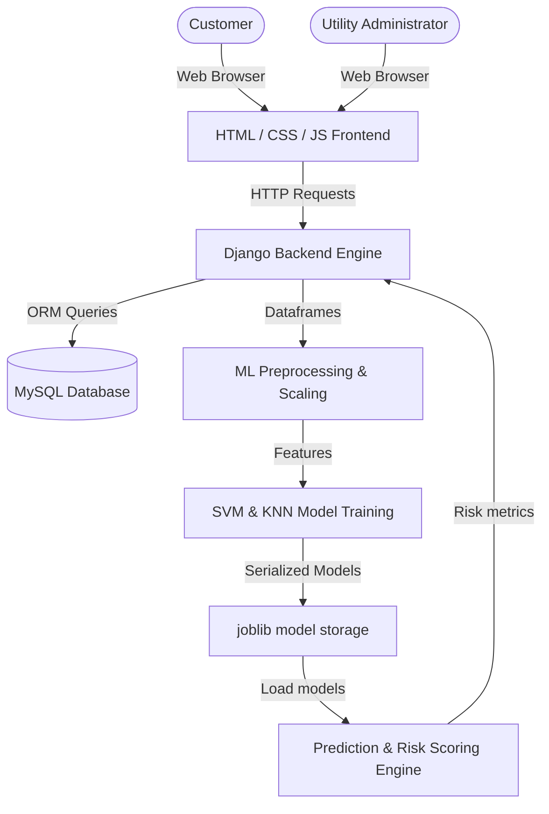
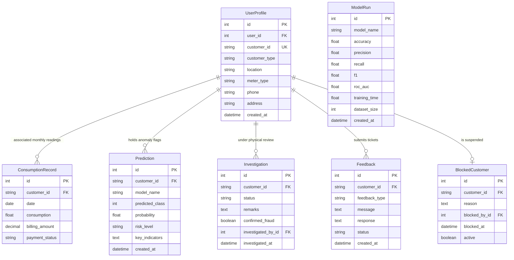
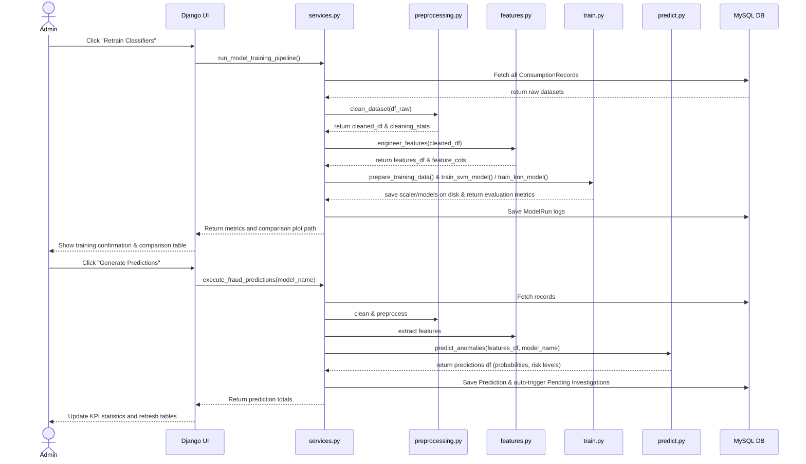
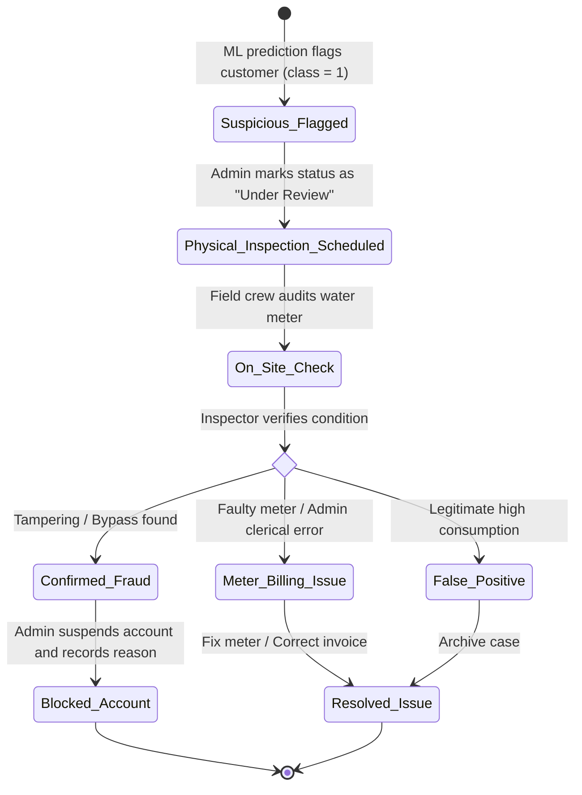

# WaterGuard System Diagrams (Mermaid)

This document contains visual diagrams for the system architecture, database schema, data flows, use cases, activities, and sequence processes.

---

## 1. System Architecture



---

## 2. Component Diagram

```mermaid
component
    [HTML5/CSS3/ChartJS Frontend] as FE
    [Django Views Controller] as Controller
    [Django ORM models] as ORM
    [MySQL Database] as MySQL
    [preprocessing.py] as Preprocess
    [features.py] as Features
    [train.py] as Train
    [predict.py] as Predict
    
    FE <--> Controller : HTTP / JSON
    Controller <--> ORM : ORM Queries
    ORM <--> MySQL : SQL
    
    Controller --> Preprocess : Raw Data
    Preprocess --> Features : Cleaned Time Series
    Features --> Train : Customer Features
    Features --> Predict : Scoring Features
    Predict --> Controller : Flags & Risk Probabilities
```

---

## 3. Entity-Relationship (ER) Diagram



---

## 4. Use Case Diagrams

### Admin Actor Use Cases
```mermaid
leftToRightDirection
actor Admin
rectangle "WaterGuard Admin Dashboard" {
    usecase "Login & Authenticate" as UC1
    usecase "Seed / Upload Dataset" as UC2
    usecase "Clean & preprocess Data" as UC3
    usecase "Train SVM and KNN" as UC4
    usecase "Evaluate and Compare Classifiers" as UC5
    usecase "Batch Score Customer Fraud Risk" as UC6
    usecase "Inspect Suspicious Customer Details" as UC7
    usecase "Update physical Inspection Status" as UC8
    usecase "Respond to User Feedbacks" as UC9
    usecase "Block / Unblock Customer account" as UC10
    usecase "Download Reports & CSV Exports" as UC11
}
Admin --> UC1
Admin --> UC2
Admin --> UC3
Admin --> UC4
Admin --> UC5
Admin --> UC6
Admin --> UC7
Admin --> UC8
Admin --> UC9
Admin --> UC10
Admin --> UC11
```

### Customer Actor Use Cases
```mermaid
leftToRightDirection
actor Customer
rectangle "WaterGuard Customer Portal" {
    usecase "Login & Authenticate" as CU1
    usecase "View Profile Metadata" as CU2
    usecase "Edit Phone and Address" as CU3
    usecase "Review Consumption History" as CU4
    usecase "View Usage Line Chart" as CU5
    usecase "Submit feedback or disputes" as CU6
}
Customer --> CU1
Customer --> CU2
Customer --> CU3
Customer --> CU4
Customer --> CU5
Customer --> CU6
```

---

## 5. Sequence Diagrams

### Admin Training & Prediction Flow


---

## 6. Activity Diagrams

### Admin Investigation Workflow

